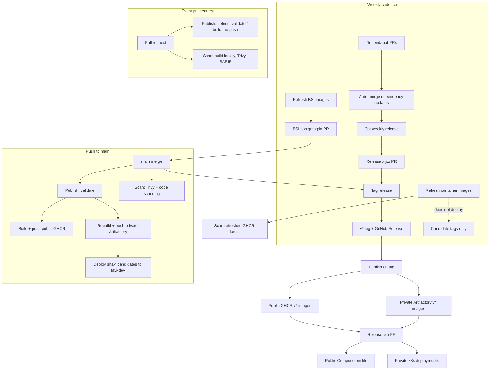
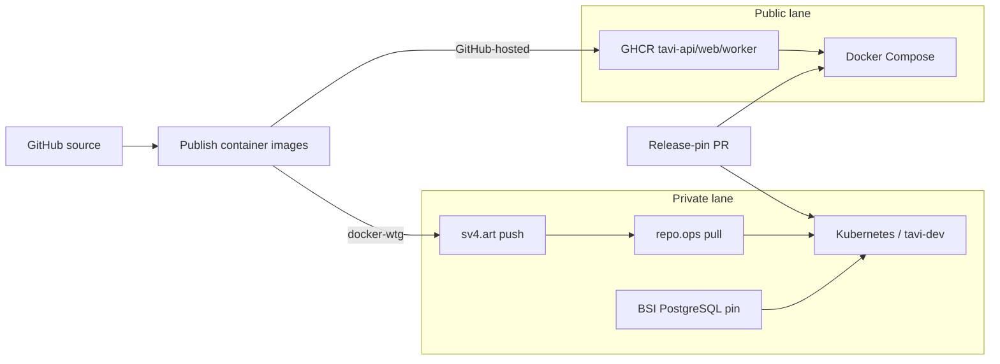
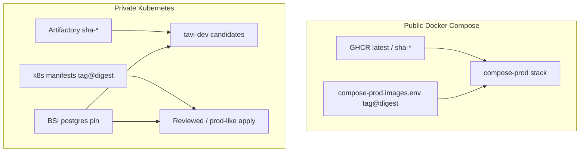

# Workflows

Map of GitHub Actions that build, scan, publish, and promote Tavi. Details and
secrets live in [`CI.md`](./CI.md); promotion rules live in [`LCM.md`](./LCM.md).

## Lanes

| Lane | Registry | Runtime | Who publishes |
| ---- | -------- | ------- | ------------- |
| **Public** | GHCR (`ghcr.io/…/tavi-{api,web,worker}`) | Docker Compose (`infra/docker`) | GitHub-hosted runners |
| **Private** | Artifactory push `sv4.art` / cluster pull `repo.ops` | Kubernetes (`infra/k8s`, `tavi-dev`) | `docker-wtg` self-hosted runner |

Public Compose may follow GHCR `:latest` or a reviewed `tag@sha256` pin.
Private Kubernetes never pulls GHCR; app images come from Artifactory, and
in-cluster Postgres is a Bitnami Secure Image pin (not Docker Hub).

`latest` and `refresh-*` are candidate tags. Production and other immutable
environments move only through a reviewed `tag@sha256:digest` pin PR.

## Sequence

Rough order of events. Several workflows run in parallel on the same trigger.

## Public vs private split

## Workflows

Each workflow file is under [`.github/workflows/`](../.github/workflows/).

### Publish container images

`publish-images.yml` — validate the workspace and produce api/web/worker images.

| When | What happens |
| ---- | ------------ |
| Pull request | Detect container-relevant paths. Required checks still appear: skip with a green placeholder, or lint/typecheck/test and build images **without** pushing. |
| Push to `main` | Same validation, then **two publishes**: GHCR (`latest`, branch, `sha-*`) on GitHub-hosted runners, and Artifactory on `docker-wtg`. After all three internal images land, deploy `sha-<shortsha>` to `tavi-dev`. |
| `v*` tag | Same dual publish with version tags, then open the release-pin PR (Compose → GHCR digests, k8s → `repo.ops` digests). |

Jobs, in order: detect changes → validate workspace → build/publish public →
publish internal → deploy tavi-dev → (tags only) create release-pin PR.

### Scan container images

`trivy-scan.yml` — security gate for code scanning and required PR checks.

- **PR / `main`:** detect changes; scan locally built api/web/worker images;
  scan the repo filesystem (misconfig + secrets); upload all SARIF categories
  together; fail on High/Critical unless listed in `.trivyignore.yaml`.
- **After a successful Refresh:** scan published GHCR `:latest` (public
  candidates only; does not deploy).

### Refresh container images

`refresh-images.yml` — Mondays 08:17 UTC or manual. Rebuilds from current
`main` with a no-cache pull of base images. Publishes `latest` + `refresh-*` to
**both** GHCR and Artifactory. Attaches SBOM/provenance. **Does not deploy.**

### Refresh BSI images

`refresh-bsi-images.yml` — Mondays 07:23 UTC, pin-file pushes, or manual.
Private lane only.

- Sync-check: `infra/images/bsi-*.pin.json` must match k8s consumers.
- Resolve latest Bitnami Secure PostgreSQL from `sv4.art`; open a pin PR if the
  digest moved.
- After the pin lands on `main`, deploy **postgres only** to `tavi-dev` (does
  not retag api/web/worker).

### Cut weekly release

`cut-release.yml` — Fridays 13:00 UTC or manual. Opens `Release x.y.z` when
`main` has work since the last release. Patch by default; minor when Unreleased
has `### Features` or `### Breaking Changes`. Enables auto-merge after required
checks.

### Tag release

`tag-release.yml` — on `main` when a `Release x.y.z` commit lands. Creates the
annotated `v*` tag and GitHub Release notes from the changelog. The tag push
re-enters **Publish**.

### Auto-merge dependency updates

`automerge-dependencies.yml` — Dependabot PRs for npm, Actions, and Docker.
Approves and enables auto-merge after required checks. Those merges then follow
the normal PR → `main` → Publish/Scan path.

## How runtimes consume images

- Public Compose: [`DOCKER.md`](./DOCKER.md). Candidate hosts may pull GHCR
  `:latest`; pinned environments use `compose-prod.images.env`.
- Private Kubernetes: [`KUBERNETES.md`](./KUBERNETES.md). `tavi-dev` is the
  automatic candidate namespace. Other clusters wait for the release-pin PR.

## Related docs

- [`CI.md`](./CI.md) — required checks, Trivy policy, Artifactory login, tavi-dev secrets.
- [`LCM.md`](./LCM.md) — immutable pins, rollback, weekly cut.
- [`GITHUB-SETUP.md`](./GITHUB-SETUP.md) — repository settings and secrets.
